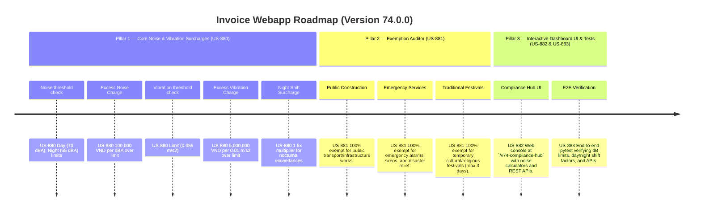

# Version 74.0.0 Product Roadmap — Noise & Vibration Pollution Surcharge Compliance Engine

This document defines the official product roadmap for **Version 74.0.0** of the GDT Invoice Hub. It implements the Noise & Vibration Pollution Surcharge (Phí tiếng ồn và độ rung) compliance engine under the **Law on Environmental Protection 2020** (standardized by **QCVN 26:2010/BTNMT** for noise and **QCVN 27:2010/BTNMT** for vibration), providing tools to calculate environmental surcharges based on statutory exceedance thresholds and day/night shift factors.

---

## 🗺️ Product Timeline & Core Pillars



---

## 📋 Story Specifications Mapping

| Story ID | Name | Core Business Objective | Target Output Format |
| :--- | :--- | :--- | :--- |
| **US-880** | Core Noise & Vibration Pollution Surcharge Engine | Calculate environmental surcharges for noise and vibration levels exceeding QCVN standards under Law on EP 2020. | Pollution surcharge ledgers |
| **US-881** | Noise & Vibration Exemption Auditor | Verify exemptions for public construction works, emergency relief sirens, and short-term traditional festivals. | Exemption audit ledgers |
| **US-882** | Interactive Version 74 Compliance Hub UI and API | Provide a web dashboard at `/v74-compliance-hub` with noise and vibration calculators and REST APIs. | HTML Dashboard UI & REST JSON APIs |
| **US-883** | End-to-End V74 Verification Test Suite | Verify noise exceedance dB calculations, shift multipliers (day/night), festival/emergency exemptions, and API endpoints. | Pytest Suite (`tests/test_v74_features.py`) |

---

## ⚙️ Technical Constraints & Integration Guidelines

1. **Noise and Vibration Standards & Rates (US-880)**:
   - Statutory limits:
     - Day Shift (06:00 - 21:00): Noise limit **70 dBA**
     - Night Shift (21:00 - 06:00): Noise limit **55 dBA**
     - Vibration limit: **0.055 m/s²**
   - Surcharges:
     - Excess noise: **100,000 VND / dBA** over the limit.
     - Excess vibration: **5,000,000 VND per 0.01 m/s²** exceedance.
     - Night Shift Multiplier: **1.5x** applied to both noise and vibration surcharges for night shift violations.
2. **Exemptions (US-881)**:
   - Direct public construction (roads, bridges, utilities) → **100% exempt**.
   - Emergency alarms, warning sirens, disaster relief operations → **100% exempt**.
   - Traditional cultural festivals (up to 3 days) → **100% exempt**.

---

## 🧪 Verification Plan

- Run validation wrapper:
   ```bash
   python scripts/harness_win.py validate --cmd "pytest tests/test_v74_features.py"
   ```
