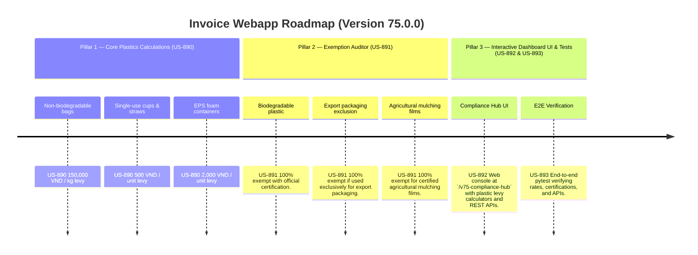

# Version 75.0.0 Product Roadmap — Single-Use Plastics & Ocean Pollution Levy Engine

This document defines the official product roadmap for **Version 75.0.0** of the GDT Invoice Hub. It implements the Single-Use Plastics & Ocean Pollution Levy (Thuế bảo vệ môi trường đối với túi ni lông và nhựa dùng một lần) compliance engine under **Decree No. 08/2022/NĐ-CP**, providing tools to calculate environmental levies on plastic bags, straws, and cups, and apply biodegradable and export packaging exemptions.

---

## 🗺️ Product Timeline & Core Pillars



---

## 📋 Story Specifications Mapping

| Story ID | Name | Core Business Objective | Target Output Format |
| :--- | :--- | :--- | :--- |
| **US-890** | Core Single-Use Plastics & Ocean Pollution Levy Engine | Calculate environmental levies on single-use plastic bags, cups, and packaging materials under Decree 08/2022/NĐ-CP. | Plastics levy ledgers |
| **US-891** | Biodegradable Plastic Certification & Exemption Inspector | Verify exemptions for certified biodegradable plastics, export packaging, and small agricultural mulching films. | Exemption verification logs |
| **US-892** | Interactive Version 75 Compliance Hub UI and API | Provide a web dashboard at `/v75-compliance-hub` with plastic levy calculators and REST APIs. | HTML Dashboard UI & REST JSON APIs |
| **US-893** | End-to-End V75 Verification Test Suite | Verify plastic unit/weight rates, biodegradable certification exemptions, export packaging exclusions, and API endpoints. | Pytest Suite (`tests/test_v75_features.py`) |

---

## ⚙️ Technical Constraints & Integration Guidelines

1. **Plastic Surcharge & Levy Rates (US-890)**:
   - Non-biodegradable plastic bags: **150,000 VND / kg**
   - Single-use plastic cups, plates, and straws: **500 VND / unit**
   - Expanded polystyrene (EPS) foam food containers: **2,000 VND / unit**
2. **Exemptions (US-891)**:
   - Certified biodegradable plastics (complying with TCVN standards) → **100% exempt**.
   - Plastic packaging used directly to pack exported goods → **100% exempt**.
   - Certified agricultural mulching films (used directly for soil coverage in farming) → **100% exempt**.

---

## 🧪 Verification Plan

- Run validation wrapper:
   ```bash
   python scripts/harness_win.py validate --cmd "pytest tests/test_v75_features.py"
   ```
