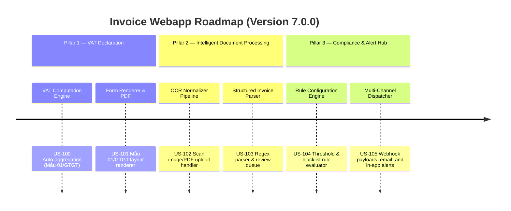

# Next-Gen Webapp XML: Version 7.0.0 Product Roadmap & Goals

This document outlines the three strategic pillars delivered in **Version 7.0.0 (Autonomous Tax Operations)** of the Webapp XML invoice auditing suite. It marks the platform's evolution into a proactive, self-filing, and document-intelligent compliance ecosystem.

---

## 🗺️ Product Roadmap Overview

---

## 📋 Milestone 7.0.0 Pillar 1: Automated VAT Declaration Engine (US-100, US-101)
*Focus: End-to-end tax filing generation directly from invoice ledgers.*

### 🎯 Goal 7.0.1: VAT Computation Engine (US-100)
- **Problem**: Businesses manually copy invoice figures to external tax software.
- **Solution**: Auto-aggregates input/output invoices for periods, computing tax payable or refundable.
- **Acceptance Criteria**:
  - Automatically identifies input vs output invoices by taxpayer MST.
  - Excludes non-deductible invoices (e.g. Cash payments >= 20M, missing signature).
  - Handles monthly/quarterly periods (expanding Q1-Q4 correctly).

### 🎯 Goal 7.0.2: Form Renderer & PDF/Excel Export (US-101)
- **Problem**: Declarations need to map to the official Vietnamese government layouts.
- **Solution**: Form template generator matching Mẫu 01/GTGT requirements.
- **Acceptance Criteria**:
  - Outputs structured form layout with indicators like [21] Total Revenue, [22] Output VAT, [23] Purchase Value, [24] Input VAT, [25] Deductible Input VAT.
  - Dynamically calculates box [40] (Payable) or [43] (Deductible/Refundable).

---

## 📸 Milestone 7.0.0 Pillar 2: Intelligent Document Processing Pipeline (US-102, US-103)
*Focus: Digitizing paper scan records into structured system models.*

### 🎯 Goal 7.0.3: OCR Text Extraction Normalizer (US-102)
- **Problem**: Scanned invoice raw texts vary wildly in layout and character encoding.
- **Solution**: Upload normalizer pipeline preparing text and determining extraction confidence.
- **Acceptance Criteria**:
  - Sanitizes carriage returns, tabs, and duplicate spaces.
  - Scores document invoice confidence based on key marker keywords.

### 🎯 Goal 7.0.4: Structured Invoice Parser (US-103)
- **Problem**: Manual entry of fields from scanned invoice texts is slow and error-prone.
- **Solution**: Heuristic pattern matchers extracting specific buyer, seller, and financial fields.
- **Acceptance Criteria**:
  - Correctly parses Vietnamese diacritics and number formats (e.g. "1.500.000,00" -> 1500000.00).
  - Extracts Seller MST, Buyer MST, Invoice Number, Symbol, Amounts, and Tax rates.
  - Routes low-confidence extractions into a manual review queue.

---

## 🔔 Milestone 7.0.0 Pillar 3: Compliance & Alert Hub (US-104, US-105)
*Focus: Real-time risk detection and instant notification dispatch.*

### 🎯 Goal 7.0.5: Rule Configuration Engine (US-104)
- **Problem**: CFOs are unaware of compliance violations until audit cycles.
- **Solution**: Real-time rule parser evaluating every invoice during import.
- **Acceptance Criteria**:
  - Supports threshold checks (e.g. amounts > limit) and blacklists (e.g. blacklisted seller MSTs).
  - Evaluates batch and single invoices against active rules.

### 🎯 Goal 7.0.6: Multi-Channel Alert Dispatcher (US-105)
- **Problem**: Alerts confined inside the webapp dashboard are easily missed.
- **Solution**: Broadcast engine dispatching alerts to external endpoints, emails, and notifications.
- **Acceptance Criteria**:
  - Formulates webhook payloads with compliance metadata.
  - Simulates email notification triggers and logs dispatch results.

---

## 📋 Epic & Story Mapping

| Epic ID | Epic Title | Story ID | Story Title | Status |
| :--- | :--- | :--- | :--- | :--- |
| **E55** | VAT Declaration Engine | **US-100** | VAT Declaration Computation Engine | ✅ Implemented |
| **E55** | VAT Declaration Engine | **US-101** | Declaration Form Template Renderer | ✅ Implemented |
| **E56** | IDP Document Pipeline | **US-102** | OCR Text Extraction Pipeline | ✅ Implemented |
| **E56** | IDP Document Pipeline | **US-103** | Structured Invoice Parser | ✅ Implemented |
| **E57** | Compliance Alert Hub | **US-104** | Compliance Rule Configuration Engine | ✅ Implemented |
| **E57** | Compliance Alert Hub | **US-105** | Multi-Channel Alert Dispatch | ✅ Implemented |
