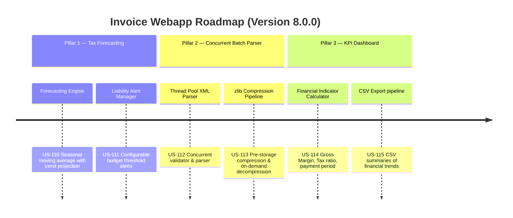

# Next-Gen Webapp XML: Version 8.0.0 Product Roadmap & Goals

This document outlines the three strategic pillars delivered in **Version 8.0.0 (Advanced Analytics & High-Performance Batch Operations)** of the Webapp XML invoice auditing suite. It marks the platform's evolution into a predictive, multi-threaded, and advanced financial analytics ecosystem.

---

## 🗺️ Product Roadmap Overview

---

## 📋 Milestone 8.0.0 Pillar 1: Predictive Tax & Cash Flow Forecasting (US-110, US-111)
*Focus: Long-term budget planning and tax payment preparation.*

### 🎯 Goal 8.0.1: Predictive Forecasting Engine (US-110)
- **Problem**: CFOs lack foresight on upcoming tax burdens, risking cash shortfalls.
- **Solution**: Seasonal trend-adjusted moving average over historical input/output VAT data.
- **Acceptance Criteria**:
  - Calculates predicted output VAT, input VAT, and net VAT payable.
  - Leverages customizable window sizes and moving average weighting coefficients ($\alpha$).

### 🎯 Goal 8.0.2: Tax Liability Budget Alerting (US-111)
- **Problem**: Large surprise tax bills trigger financial stress.
- **Solution**: Automated alerting daemon validating projected payable amounts against budget boundaries.
- **Acceptance Criteria**:
  - Triggers alerts only when projected liabilities overshoot enterprise budget limits.

---

## 📸 Milestone 8.0.0 Pillar 2: High-Performance Parallel Batch XML Parser & Compressor (US-112, US-113)
*Focus: Processing large invoice volumes at scale.*

### 🎯 Goal 8.0.3: Parallel XML Batch Parser (US-112)
- **Problem**: Batch uploads of thousands of invoices bottleneck CPU/IO resources when parsed sequentially.
- **Solution**: Thread-pool execution engine reading and validating XML files concurrently.
- **Acceptance Criteria**:
  - Handles parsing errors gracefully without failing the entire batch process.
  - Extracts key invoice tags concurrently.

### 🎯 Goal 8.0.4: Batch Compressor Pipeline (US-113)
- **Problem**: Plaintext XML files consume excessive storage.
- **Solution**: High-performance zlib compression layer storing compressed bytes and unpacking on-demand.
- **Acceptance Criteria**:
  - Decompression produces byte-identical XML inputs.

---

## 📊 Milestone 8.0.0 Pillar 3: Advanced Financial KPI Dashboard & Export Pipeline (US-114, US-115)
*Focus: Business intelligence and executive reporting.*

### 🎯 Goal 8.0.5: Financial Metrics Engine (US-114)
- **Problem**: Financial platforms only display compliance statuses, not operational performance.
- **Solution**: Aggregation math module calculating Gross Margin, Tax-to-Revenue ratios, and Average Payment Clearance Periods.
- **Acceptance Criteria**:
  - Prevents DivisionByZero bugs for empty historical ledgers.

### 🎯 Goal 8.0.6: CSV Financial Trend Export (US-115)
- **Problem**: Financial teams need raw reports for further manual analysis in external tools.
- **Solution**: Standardized CSV file builder compiling KPI metrics per month/quarter.
- **Acceptance Criteria**:
  - Produces RFC-4180 compliant CSV files with appropriate headers.

---

## 📋 Epic & Story Mapping

| Epic ID | Epic Title | Story ID | Story Title | Status |
| :--- | :--- | :--- | :--- | :--- |
| **E58** | Predictive Tax Forecasting | **US-110** | Predictive Cash Flow Engine | ✅ Implemented |
| **E58** | Predictive Tax Forecasting | **US-111** | Tax Liability Budget Alerting | ✅ Implemented |
| **E59** | Batch Operations | **US-112** | High-Performance XML Parser | ✅ Implemented |
| **E59** | Batch Operations | **US-113** | Batch Compressor Pipeline | ✅ Implemented |
| **E60** | Financial KPI Dashboard | **US-114** | Financial Metrics Engine | ✅ Implemented |
| **E60** | Financial KPI Dashboard | **US-115** | CSV Financial Trend Export | ✅ Implemented |
