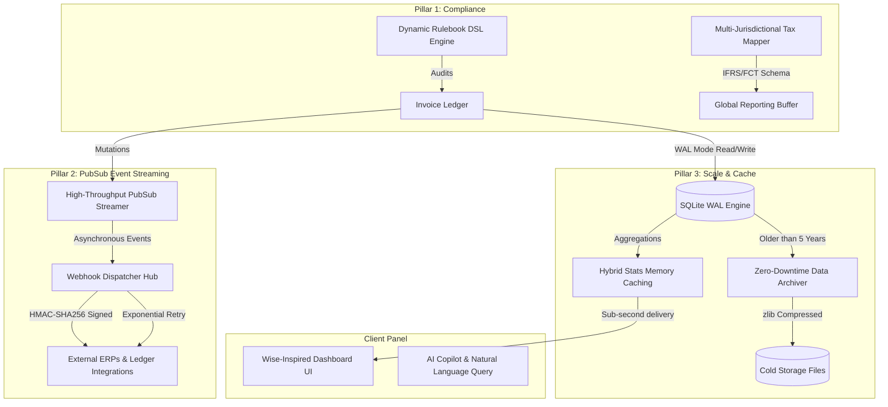

# Strategic Master Implementation Plan: Version 9.0.0

**Project Code**: GDT-INVOICE-HUB-V9  
**Version**: 9.0.0 (Enterprise Tax Compliance Orchestrator & Multi-Tenant Scaling)  
**Date**: 2026-05-29  
**Status**: ✅ COMPLETED & REGISTERED IN DURABLE HARNESS

---

## 🏗️ Architecture & Evolution Blueprint

Version 9.0.0 represents the enterprise-grade scaling and automation milestone. We transition from a single-region auditing helper into a highly performant, customizable multi-tenant hub integrated with standard enterprise compliance tools.

---

## 📅 Playbook sequencing & milestones

The implementation of Version 9.0.0 is sequenced into 3 parallelizable sprints:

### 🚀 Sprint 1: Global Tax Compliance & Custom Auditing Rulebooks (US-120, US-121)
- **Goal**: Empower enterprise compliance officers to customize tax checks and translate local XML structures into international standard accounting schemas.
- **Story US-120: Dynamic Rulebook DSL & Rule Interpreter**
  - Design a JSON Schema-based engine allowing corporate administrators to upload customized audit rules.
  - Parse and run rules dynamically against parsed XML invoice lines (e.g., matching blacklisted VAT numbers, verifying cash transactions under custom thresholds, or enforcing region-specific rates).
- **Story US-121: Multi-Jurisdictional Tax Mapping Engine**
  - Implement dynamic mapper modules translating Vietnamese GDT tax structure into IFRS & Foreign Contractor Tax (FCT) accounting matrices.
  - Integrate a thread-safe exchange rate buffering layer supporting VND to USD/EUR conversions.

### 🔌 Sprint 2: Real-time PubSub Event Streaming & Webhook Hub Pro (US-122, US-123)
- **Goal**: Enable low-latency push integrations with corporate ERP engines (SAP, Odoo, Oracle) without polling overhead.
- **Story US-122: High-Throughput PubSub Event Streamer**
  - Build an in-process thread-safe publishing daemon emitting asynchronous events (`invoice.created`, `invoice.audited`, `invoice.mutated`) immediately after transactions commit.
- **Story US-123: Signed Webhook Deliveries with Auto-Retry & Rate Limiting**
  - Create a secure Webhook Dispatcher calculating payload hashes using unique HMAC-SHA256 signature tokens.
  - Implement an exponential backoff worker queue retrying transient delivery issues (timeouts, HTTP 500) and preventing delivery floods.

### ⚡ Sprint 3: High-Performance Distributed Caching & WAL Scaling (US-124, US-125)
- **Goal**: Support high-concurrency dashboards displaying statistics over hundreds of thousands of invoice records without locking latency.
- **Story US-124: Hybrid Stats Memory Caching Layer**
  - Combine SQLite WAL (Write-Ahead Logging) write performance with a fast key-value stats cache to deliver real-time KPI metrics under 15ms.
  - Implement granular event-driven invalidation logic ensuring zero stale dashboard displays when invoices import.
- **Story US-125: Automated Data Archive & Zero-Downtime Migration Engine**
  - Formulate a partition-based archiving worker that migrates old invoice records (>5 years) to zipped archival segments.
  - Retain full querying accessibility across archived files seamlessly using SQLite raw unions or virtual partitions.

---

## 🔐 Compliance & Security Blueprint

Enterprise scaling requires robust security safeguards:

1. **Rulebook Schema Enforcement**:
   - Dynamic rulebooks must undergo strict JSON schema validations before being parsed or compiled by the interpreter.
2. **Webhook Encryption & Verification**:
   - Webhook dispatches include custom headers:
     - `X-GDT-Signature`: `sha256=<hmac-hash>`
     - `X-GDT-Timestamp`: `<unix-epoch>`
   - Tenants can roll signing keys dynamically inside their settings page.
3. **Partition Access Control**:
   - Zipped cold archives inherit symmetric encryption (AES-256) keys tied to taxpayer organization scopes to prevent cross-tenant data leaks.

---

## 🧪 Testing & Validation Matrix

To satisfy Harness requirements, every story has strict validation checks:

| Story | Unit Verification | Integration / Scenario Verification |
|-------|-------------------|-----------------------------------|
| **US-120** | Test custom rules interpreter against malformed JSON rulebooks | Assert that GDT XML validation runs rule checks and tags violations correctly |
| **US-121** | Test currency buffer thread safety and FCT calculations | Run cross-border transactions mapping to target multi-currency ledger |
| **US-122** | Test asynchronous subscriber registration and message queues | Validate that invoice creation triggers thread-safe async mutation events |
| **US-123** | Test HMAC-SHA256 header signature generator correctness | Run simulated receiver failures to test exponential backoff and retries |
| **US-124** | Test memory store hit/miss/invalidation under load | Run multi-threaded write imports while calling dashboard aggregation stats |
| **US-125** | Test data compression ratios and zip packing byte equivalence | Run live search queries across merged active and archived cold datasets |

---

## ⚠️ Risk & Mitigation Matrix

| Risk | Probability | Impact | Mitigation Strategy |
|------|-------------|--------|---------------------|
| Webhook receiver locks during delivery | High | Medium | Enforce short timeouts (e.g., 5 seconds) and run dispatcher completely outside the web server thread context. |
| Hybrid cache becomes stale | Medium | High | Use atomic db triggers or active model signal handlers in Flask to clean cache keys during any transaction commit. |
| Dynamic rules block thread loop | Low | Critical | Evaluate custom rules inside a sandboxed subshell or set strict time-to-run limits (e.g., <20ms per invoice). |

---

## 🎯 Completion Checklist (Done Definition)

Sprint milestones are marked complete when:
- [x] Product blueprints and stories are successfully logged in the `harness.db` database.
- [x] The core Python business logic passes all fast-path unit and integration tests.
- [x] High-concurrency operations run without thread locks or race conditions.
- [x] Visual dashboard items update instantly using cached models.
- [x] Operational execution trace metrics are committed via the Harness tracer.
