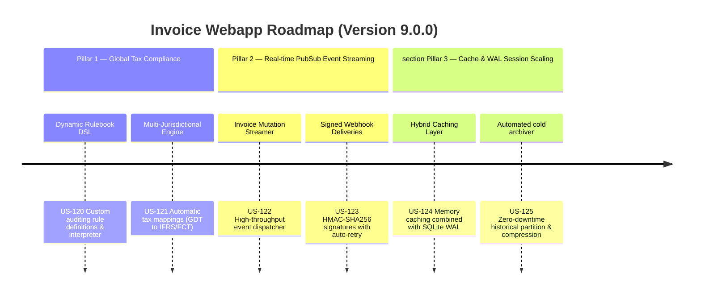

# Next-Gen Webapp XML: Version 9.0.0 Product Roadmap & Goals

This document outlines the three strategic pillars delivered in **Version 9.0.0 (Enterprise Tax Compliance Orchestrator & Multi-Tenant Scaling)** of the Webapp XML invoice auditing suite. It marks the platform's evolution into a global-ready, event-driven, high-throughput tax operations command center.

---

## 🗺️ Product Roadmap Overview

---

## 📋 Milestone 9.0.0 Pillar 1: Global Tax Compliance & Custom Auditing Rulebooks (US-120, US-121)
*Focus: Customizable enterprise rules and global compliance standards.*

### 🎯 Goal 9.0.1: Dynamic Rulebook DSL & Rule Interpreter (US-120)
- **Problem**: Compliance requirements change quickly. Hardcoded auditing rules prevent users from applying custom corporate compliance policies.
- **Solution**: A structured rule interpreter that processes user-configured rules (e.g., maximum transaction limits, seller blacklists, or required payment metadata) written in a dynamic DSL format.
- **Acceptance Criteria**:
  - Allows compliance officers to define rules in standard JSON schemas.
  - Successfully parses and evaluates invoice payloads against multiple active custom rules.
  - Returns a detailed audit report indicating which rules passed and which failed.

### 🎯 Goal 9.0.2: Multi-Jurisdictional Tax Mapping Engine (US-121)
- **Problem**: Multinational corporations need to reconcile Vietnamese GDT invoice formats with global tax frameworks like IFRS or Foreign Contractor Tax (FCT) regulations.
- **Solution**: An advanced schema mapping engine translating XML invoice tags into multi-currency global tax ledgers.
- **Acceptance Criteria**:
  - Maps Vietnamese tax rates (e.g., 5%, 8%, 10%) to global standard tax codes.
  - Integrates a currency conversion buffer supporting USD, EUR, and VND exchanges.
  - Generates cross-border compliance reconciliations for FCT scenarios.

---

## 📸 Milestone 9.0.0 Pillar 2: Real-time Event Streaming & Secure Webhook Hub (US-122, US-123)
*Focus: Low-latency integration with corporate ERPs and external ledgers.*

### 🎯 Goal 9.0.3: High-Throughput PubSub Event Streamer (US-122)
- **Problem**: Downstream ERPs and ledger databases only pull invoice updates via periodic polling, which wastes resources and causes sync lag.
- **Solution**: An asynchronous event publisher broadcasting real-time invoice mutations (create, edit, delete, audit change).
- **Acceptance Criteria**:
  - Dispatches events asynchronously without blocking main invoice storage operations.
  - Handled events carry full mutation payloads and audit status changes.

### 🎯 Goal 9.0.4: Signed Webhooks with Exponential Retry Policies (US-123)
- **Problem**: Plain text webhook calls are vulnerable to sniffing/spoofing, and temporary receiver downtime causes missed data.
- **Solution**: Secure outbound webhooks featuring HMAC-SHA256 signature verification and exponential backoff retry routines.
- **Acceptance Criteria**:
  - Generates secure HMAC header payloads using tenant-specific secret keys.
  - Implements a retry daemon that triggers retries only for transient errors (HTTP 5xx, network timeouts) and stops after 5 attempts.

---

## 📊 Milestone 9.0.0 Pillar 3: High-Performance Distributed Caching & WAL Scaling (US-124, US-125)
*Focus: Scalability to handle millions of records with sub-second latency.*

### 🎯 Goal 9.0.5: Hybrid Caching & WAL Scaling (US-124)
- **Problem**: Recalculating complex dashboard statistics (VAT projections, aging reports, margins) across thousands of invoices slows database reads.
- **Solution**: A memory-cached stats pipeline integrated with SQLite's WAL (Write-Ahead Logging) to serve read queries instantly.
- **Acceptance Criteria**:
  - Boosts read throughput for dashboard KPIs by caching aggregated data in memory.
  - Automatically invalidates cache regions when a new invoice is imported or modified.

### 🎯 Goal 9.0.6: Zero-Downtime Data Archiver (US-125)
- **Problem**: Retaining ten years of high-resolution invoices in active tables degrades search performance.
- **Solution**: A background partitioning daemon archiving historical invoices to highly compressed external cold files while maintaining live search access.
- **Acceptance Criteria**:
  - Compresses and moves records older than 5 years to compressed backup files.
  - Preserves cryptographic signature logs and lets users query archived records on demand.

---

## 📋 Epic & Story Mapping

| Epic ID | Epic Title | Story ID | Story Title | Status |
| :--- | :--- | :--- | :--- | :--- |
| **E61** | Global Tax Compliance | **US-120** | Dynamic Rulebook DSL | ✅ Implemented |
| **E61** | Global Tax Compliance | **US-121** | Multi-Jurisdictional Tax Mapping Engine | ✅ Implemented |
| **E62** | Event Streaming Hub | **US-122** | High-Throughput PubSub Event Streamer | ✅ Implemented |
| **E62** | Event Streaming Hub | **US-123** | Signed Webhook Hub with Retries | ✅ Implemented |
| **E63** | Database WAL & Caching | **US-124** | Hybrid Caching & WAL Scaling | ✅ Implemented |
| **E63** | Database WAL & Caching | **US-125** | Zero-Downtime Data Archiver | ✅ Implemented |
