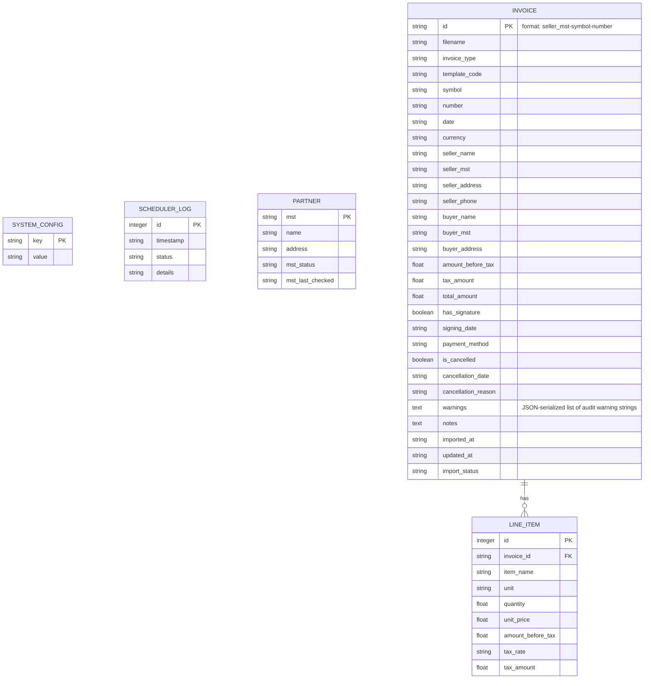

# Design: US-025 Database Persistence and SQLite Migration

## Domain Model

Entities represented in SQLite:
- **Invoice**: Core invoice record. Contains identification, timestamps, seller/buyer info, total sums, signature metadata, validation status, audit warning lists, and import metadata.
- **LineItem**: Specific items/services listed on an invoice. Linked via foreign key to the parent `Invoice`.
- **Partner**: Extracted vendor metadata containing MST, vendor name, address, tax registration status, and cache update timestamps.
- **SystemConfig**: Dynamic application key-value configuration values (such as SMTP details, time intervals, GDT username/passwords).
- **SchedulerLog**: Historical logs of scheduler runs.

## Data Model

### SQLite Tables & Columns



### Constraints & Concurrency
- **Foreign Keys**: `line_item.invoice_id` references `invoice.id` with `ON DELETE CASCADE`.
- **WAL Mode**: Executed on database connection to optimize concurrent transactions:
  ```sql
  PRAGMA journal_mode=WAL;
  PRAGMA synchronous=NORMAL;
  ```
- **Transaction Retry**: To handle potential database locks under extreme concurrent test runs, a simple retry handler or transaction context decorator is used for writing.

## Interface Contract

All HTTP APIs remain unchanged. The backend query logic returns identical JSON structures to the frontend AJAX callers:
- `GET /api/settings` and `POST /api/settings`
- `GET /api/settings/logs`
- `GET /api/invoices` and `POST /api/invoices/import`
- `/api/invoices/<id>/details`

## Observability

All database initialization and migration steps write logging info to Flask's app logs. Failed migrations trigger diagnostic messages.
