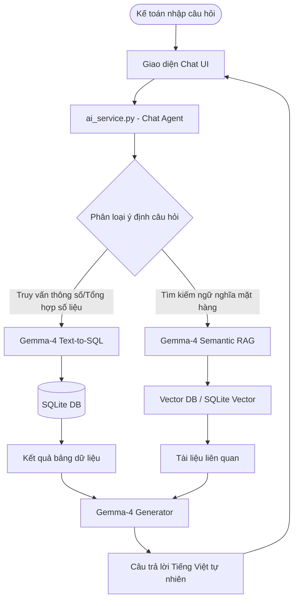

# US-028: Kế Hoạch Tích Hợp AI Đào Sâu Bằng Google Gemma-4 (Local LLM Integration Plan)

## Status

completed

## Lane

normal

## Product Contract

The application will leverage the highly capable, free local **Google Gemma-4** LLM model (running via Ollama, LM Studio, or vLLM) to perform offline, 100% private, and extremely cost-effective operations on electronic invoices:
1. **Trình Trợ Lý Hỏi Đáp Thông Minh (RAG & Text-to-SQL Assistant)**: Cho phép kế toán truy vấn, thống kê và tìm kiếm hóa đơn bằng ngôn ngữ tự nhiên tiếng Việt trực tiếp trên giao diện Supabase UI.
2. **Kiểm Toán Tuân Thủ Chuyên Sâu (Advanced Tax Compliance Auditing)**: Nâng cấp bộ quy tắc kiểm toán để phát hiện hành vi trốn thuế, hóa đơn mua sắm cá nhân không đúng mục đích doanh nghiệp, hoặc đơn giá bất thường.
3. **Phân Loại & Chuẩn Hóa Danh Mục Mặt Hàng (Intelligent Expense Classification)**: Tự động phân loại hàng ngàn mặt hàng tự do từ XML vào các tài khoản chi phí tiêu chuẩn (GAAP/VAS) hoặc danh mục nội bộ.
4. **Tự Động Sửa Sai & Hoàn Thiện Metadata (XML Intelligent Data Repair)**: Sử dụng mô hình cục bộ để tự động khôi phục dữ liệu bị khuyết thiếu, chuẩn hóa địa chỉ viết tắt và chuyển đổi số tiền thành chữ viết tiếng Việt.

## Relevant Product Docs

- `docs/ARCHITECTURE.md`
- `PROGRESS_TRACKER_INVOICE_WEBAPP.md`
- `invoices/ai_service.py`
- `docs/stories/backlog.md`

## Acceptance Criteria

1. **Cấu Hình Gemma-4 Cục Bộ (Ollama Integration)**:
   - Hỗ trợ tải và chạy mô hình `gemma-4` (hoặc các phiên bản quantized `gemma-2` / `gemma-4:9b-instruct`) thông qua cổng dịch vụ Ollama cục bộ (`http://localhost:11434`).
   - Bổ sung cấu hình tối ưu tham số suy luận (Temperature = 0.05 để đảm bảo tính chính xác cao nhất, Context Window = 8192 token).
2. **Trình Trợ Lý Truy Vấn Ngôn Ngữ Tự Nhiên (NLQ Assistant)**:
   - Xây dựng giao diện Chatbot kính mờ (glassmorphism panel) ở góc phải dưới màn hình với hiệu ứng trượt mở mượt mà.
   - Triển khai giải pháp **Hybrid RAG & Text-to-SQL**:
     - *Text-to-SQL*: Nhận câu hỏi (VD: "Tìm hóa đơn trên 10 triệu của đối tác ABC trong tháng này"), Gemma-4 chuyển dịch thành truy vấn SQL an toàn, thực thi trên cơ sở dữ liệu SQLite cục bộ và trả kết quả.
     - *Semantic RAG*: Sử dụng vector embeddings cục bộ (như `nomic-embed-text`) để tìm kiếm ngữ nghĩa sâu của các mặt hàng phức tạp.
3. **Bộ Quy Tắc Kiểm Toán Thuế Nâng Cao (VAT Law 2024 Audit Rules)**:
   - Thiết kế prompt hệ thống (system prompt) cực kỳ chi tiết cho Gemma-4 dựa trên quy định Luật Thuế GTGT 2024 mới nhất của Việt Nam.
   - Nhận diện các chi phí không được trừ khi tính thuế TNDN (như mua rượu bia, trang sức, dịch vụ spa, du lịch cá nhân gắn nhãn hóa đơn công ty).
4. **Công Cụ Tự Động Phân Loại Chi Phí (Auto-Classifier)**:
   - Tạo API Endpoint `/api/ai/classify-items` tự động nhóm danh mục các mặt hàng trong hóa đơn vào 8 nhóm chi phí chính (Văn phòng phẩm, Thiết bị công nghệ, Chi phí tiếp khách, Tiếp thị, Vận chuyển, v.v.).
5. **Hiệu Suất Suy Luận Tối Ưu (Performance Optimization)**:
   - Kích hoạt tính năng **Structured Outputs** (nhận diện định dạng JSON cứng bằng schema của Ollama / Gemma-4) để tránh lỗi phân tách chuỗi text.
   - Tối ưu hóa bộ nhớ RAM bằng cách áp dụng kỹ thuật FlashAttention và chạy mô hình quantized 4-bit (chỉ tiêu tốn ~5.5GB VRAM/RAM, phù hợp với hầu hết máy tính văn phòng kế toán).

## Design Notes

### 1. Kiến Trúc Luồng Dữ Liệu (Hybrid RAG & Text-to-SQL)



### 2. Thiết Kế Cơ Sở Dữ Liệu Tích Hợp (`invoices/models.py`)

Thêm bảng lưu trữ lịch sử cuộc hội thoại để kế toán có thể tiếp tục luồng chat:
```python
class AIChatSession(db.Model):
    __tablename__ = "ai_chat_sessions"
    id = db.Column(db.String(36), primary_key=True)
    title = db.Column(db.String(255), nullable=False)
    created_at = db.Column(db.String(19), nullable=False)

class AIChatMessage(db.Model):
    __tablename__ = "ai_chat_messages"
    id = db.Column(db.Integer, primary_key=True, autoincrement=True)
    session_id = db.Column(db.String(36), db.ForeignKey("ai_chat_sessions.id", ondelete="CASCADE"), nullable=False)
    role = db.Column(db.String(10), nullable=False)  # 'user' hoặc 'assistant'
    content = db.Column(db.Text, nullable=False)
    created_at = db.Column(db.String(19), nullable=False)
```

### 3. API Endpoints Dự Kiến

- `GET /api/ai/chat/sessions` - Lấy danh sách phiên hội thoại.
- `POST /api/ai/chat/message` - Gửi tin nhắn mới và nhận phản hồi từ Gemma-4.
- `POST /api/ai/classify-items` - Thực hiện phân loại danh mục hàng loạt.
- `POST /api/ai/audit/interactive` - Kích hoạt kiểm toán chi tiết thủ công ngay trên UI.

## Validation

| Layer | Expected proof |
| --- | --- |
| Unit | Viết `tests/test_ai_gemma.py` giả lập Ollama Gemma-4 trả về JSON phân loại chi phí hợp lệ. |
| Integration | Đảm bảo an toàn SQL Injection bằng cách kiểm tra bộ Parser kiểm duyệt câu lệnh SQL được Gemma-4 sinh ra trước khi chạy trên DB SQLite. |
| E2E | Sử dụng browser subagent kiểm thử tính năng chat, gửi tin nhắn truy vấn tiếng Việt, nhận câu trả lời dạng bảng/list và xác thực hiển thị biểu đồ SVG tương ứng. |

## Harness Delta

- Thêm cấu hình `ai_model_name: "gemma-4"` làm lựa chọn mặc định khi cấu hình Ollama.
- Cập nhật tài liệu `docs/TEST_MATRIX.md` thêm Epic mới **E27: Trợ Lý Kiểm Toán AI Gemma-4**.

---

## Lộ Trình Triển Khai Chi Tiết (Milestones)

### Giai Đoạn 1: Thiết Lập Môi Trường Cục Bộ & Prompt Engineering (Tuần 1)
- Tải mô hình `gemma-4`instruct thông qua Ollama cục bộ.
- Xây dựng và tinh chỉnh System Prompt tối ưu cho ngữ cảnh luật thuế Việt Nam.
- Thiết lập cơ sở hạ tầng an toàn cho việc dịch chuyển ngôn ngữ sang câu lệnh SQL (Safe Text-to-SQL).

### Giai Đoạn 2: Xây Dựng Giao Diện Chat UI Tương Tác & Lịch Sử (Tuần 2)
- Thiết kế bảng Chatbot kính mờ tinh tế theo ngôn ngữ thiết kế dark emerald của Supabase.
- Tích hợp hiệu ứng hoạt hình gõ chữ (typing bubble) và định dạng Markdown/Bảng dữ liệu cho phản hồi của AI.
- Lưu trữ lịch sử chat cục bộ trong SQLite.

### Giai Đoạn 3: Tích Hợp Công Cụ Phân Loại & RAG Ngữ Nghĩa (Tuần 3)
- Triển khai thuật toán gán thẻ chi phí (Expense tagging) dựa trên tri thức kế toán chuẩn.
- Thực hiện kết nối tìm kiếm tương đồng ngữ nghĩa bằng Vector Embeddings.
- Chạy toàn diện validation tests và tối ưu hóa hiệu suất (độ trễ dưới 2.5 giây mỗi truy vấn).
