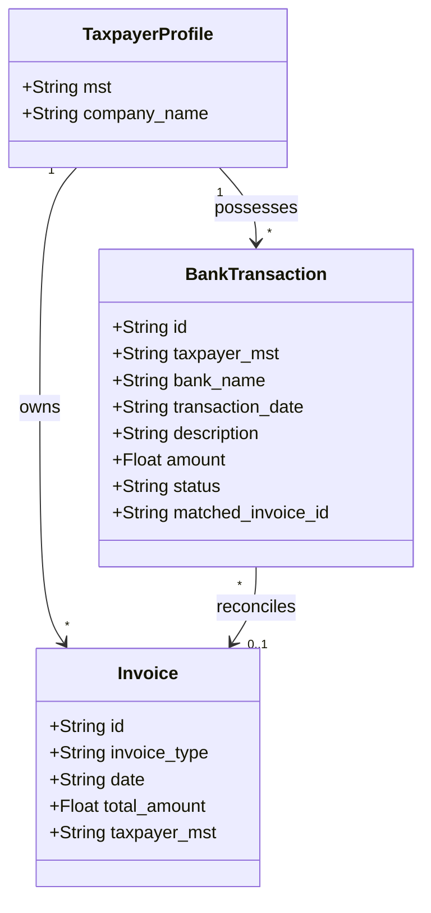
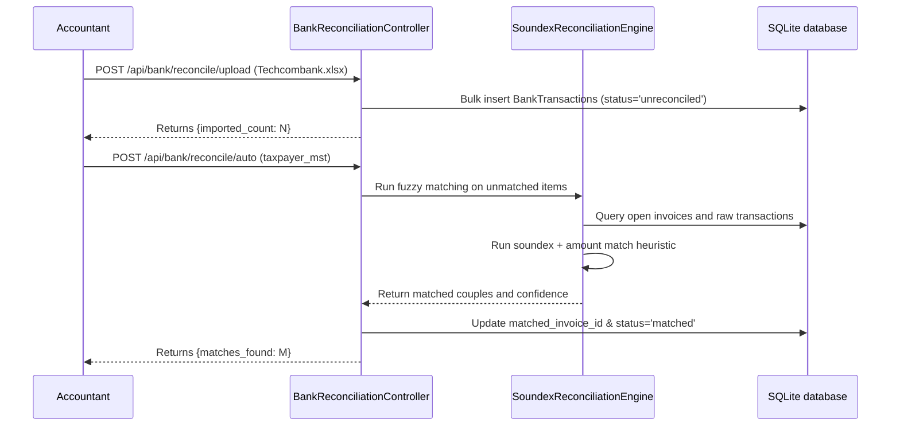

# Design: US-080 & US-081 AI-Powered Multi-Source Bank Reconciliation

## Domain Model



### Business Matching Rules (The Soundex/NLP Reconciliation Engine)
1. **Perfect Metadata Match (99% Confidence)**:
   - Matches a substring in the bank remark (e.g. `HD-1002`, `HD1002`, `1002`) directly with the `number` or `id` column of `Invoice`.
2. **Entity Similarity Match (85% Confidence)**:
   - Extracts all uppercase alphanumeric sequences from transfer remarks.
   - Cleans common Vietnamese abbreviations (e.g. `CTY` -> `CÔNG TY`, `CP` -> `CỔ PHẦN`, `TNHH` -> `TRÁCH NHIỆM HỮU HẠN`).
   - Computes **Phonetic/Soundex signature** and **Levenshtein distance** to matching active Invoice counterpart names (`buyer_name` / `seller_name`).
3. **Amount-Window Constraints**:
   - Rejects matches where transaction amount exceeds or falls short of the unpaid invoice amount by more than 5% (to prevent false positive matches, unless specifically processed as partial payments).

---

## Application Flow



---

## Interface Contract

### 1. Ingestion Endpoint
`POST /api/bank/reconcile/upload`
- **Request (Multipart Form)**:
  - `file`: CSV or Excel file containing statements.
  - `bank_name`: "Vietcombank", "Techcombank", "ACB"
  - `taxpayer_mst`: Active profile MST.
- **Response (200 OK)**:
  ```json
  {
    "status": "success",
    "imported_count": 15,
    "duplicated_skipped": 2
  }
  ```

### 2. Auto Match Endpoint
`POST /api/bank/reconcile/auto`
- **Request (JSON)**:
  ```json
  {
    "taxpayer_mst": "0109998887"
  }
  ```
- **Response (200 OK)**:
  ```json
  {
    "status": "success",
    "matches_found": 8,
    "details": [
      {
        "transaction_id": "TX-10029",
        "description": "CONG TY TOAN CAU THANH TOAN TIEN HD 2005",
        "matched_invoice_id": "PUR-VAL-02",
        "confidence": "95%",
        "reason": "Exact invoice number '2005' matched"
      }
    ]
  }
  ```

---

## Data Model

### `bank_transactions` Table DDL
```sql
CREATE TABLE bank_transactions (
    id VARCHAR(50) PRIMARY KEY,
    taxpayer_mst VARCHAR(20) NOT NULL,
    bank_name VARCHAR(50) NOT NULL,
    account_number VARCHAR(50) NOT NULL,
    transaction_date VARCHAR(20) NOT NULL,
    reference_number VARCHAR(100) UNIQUE,
    description TEXT NOT NULL,
    amount REAL NOT NULL,
    status VARCHAR(20) DEFAULT 'unreconciled',
    matched_invoice_id VARCHAR(50),
    imported_at VARCHAR(30) NOT NULL,
    FOREIGN KEY(taxpayer_mst) REFERENCES taxpayer_profiles(mst),
    FOREIGN KEY(matched_invoice_id) REFERENCES invoices(id)
);
CREATE INDEX idx_bank_reconcile ON bank_transactions(taxpayer_mst, status);
```

---

## UI / Platform Impact
We will add an interactive **"Đối Chiếu Ngân Hàng" (Bank Reconciliation)** view in the meInvoice workspace. It displays a dual-table layout:
- **Left Column**: Unreconciled bank statement transactions (with red glowing badges).
- **Right Column**: Outstanding unpaid XML invoices.
- **Central Action Button**: `Chạy Đối Chiếu AI` triggers the Soundex engine with dynamic animated lines joining the matched transaction card to its matching invoice card.
