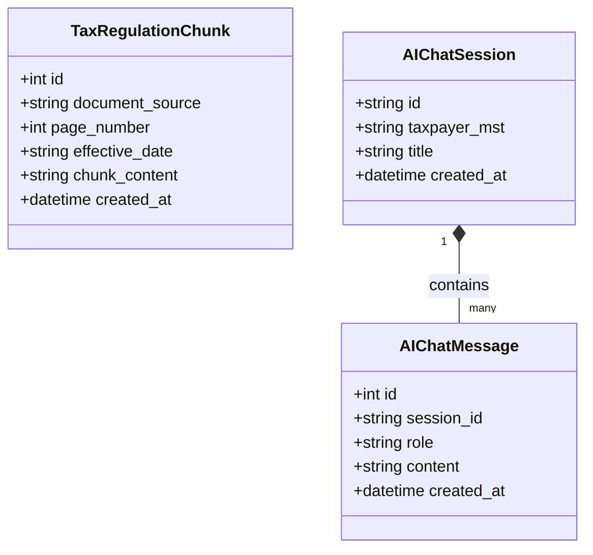
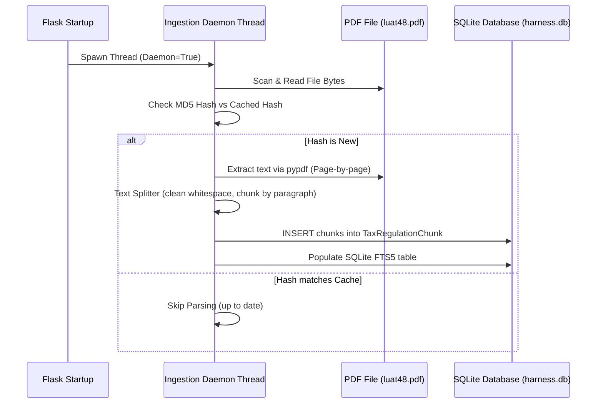
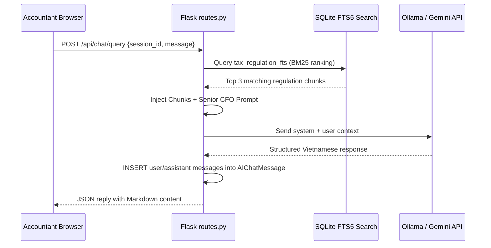

# Technical Design: Enterprise AI Chatbot RAG Upgrade (Dynamic Ingestion & Glassmorphic Chat UX)

## Domain Model

We establish three new persistent domain models to represent crawled knowledge, chat threads, and message logs:



### Business Rules:
* **Unique PDF Processing**: Chunks are mapped to document filenames. Before parsing, we compute a file checksum. Ingestion only triggers if the file hash changes, preventing duplicate chunks.
* **Lexical BM25 Ranking**: Search utilizes BM25 lexical ranking via SQLite's full-text search capability, which matches query terms against documents, weighting rare words higher.

---

## Application Flow

### Ingestion Pipeline (Background Startup Daemon)


### Chat Retrieval & Query Flow


---

## Interface Contract

### 1. Create Chat Session
* **URL**: `POST /api/chat/session`
* **Request DTO**:
  ```json
  {
    "taxpayer_mst": "0109999999",
    "title": "Tư vấn Luật 149 về nông sản"
  }
  ```
* **Response DTO**:
  ```json
  {
    "session_id": "c1f7a075-802d-419b-a36c-d2c00a6abf5b",
    "title": "Tư vấn Luật 149 về nông sản",
    "created_at": "2026-05-27 14:10:00"
  }
  ```

### 2. Fetch Session History
* **URL**: `GET /api/chat/session/<session_id>/history`
* **Response DTO**:
  ```json
  [
    {
      "role": "user",
      "content": "Luật 149 có được miễn thuế nông sản không?",
      "created_at": "2026-05-27 14:10:15"
    },
    {
      "role": "assistant",
      "content": "Căn cứ Luật số 149/2025/QH15...",
      "created_at": "2026-05-27 14:10:30"
    }
  ]
  ```

### 3. Submit RAG Query
* **URL**: `POST /api/chat/query`
* **Request DTO**:
  ```json
  {
    "session_id": "c1f7a075-802d-419b-a36c-d2c00a6abf5b",
    "message": "Ngưỡng 500 triệu đồng áp dụng cho ai?"
  }
  ```
* **Response DTO**:
  ```json
  {
    "session_id": "c1f7a075-802d-419b-a36c-d2c00a6abf5b",
    "answer": "Theo Luật sửa đổi bổ sung Luật Thuế GTGT số 149/2025/QH15...",
    "sources": [
      {
        "source": "luat149.signed.pdf",
        "page": 1,
        "score": 14.85
      }
    ]
  }
  ```

---

## Data Model

We define SQLite tables in SQLAlchemy style:

```python
class TaxRegulationChunk(db.Model):
    __tablename__ = 'tax_regulation_chunk'
    id = db.Column(db.Integer, primary_key=True, autoincrement=True)
    document_source = db.Column(db.String(255), nullable=False)
    page_number = db.Column(db.Integer, nullable=False)
    effective_date = db.Column(db.String(10), nullable=True)  # YYYY-MM-DD
    chunk_content = db.Column(db.Text, nullable=False)
    created_at = db.Column(db.DateTime, default=datetime.utcnow)

class AIChatSession(db.Model):
    __tablename__ = 'ai_chat_session'
    id = db.Column(db.String(36), primary_key=True)  # UUID
    taxpayer_mst = db.Column(db.String(20), db.ForeignKey('taxpayer_profile.mst'), nullable=True)
    title = db.Column(db.String(255), nullable=False)
    created_at = db.Column(db.DateTime, default=datetime.utcnow)

class AIChatMessage(db.Model):
    __tablename__ = 'ai_chat_message'
    id = db.Column(db.Integer, primary_key=True, autoincrement=True)
    session_id = db.Column(db.String(36), db.ForeignKey('ai_chat_session.id'), nullable=False)
    role = db.Column(db.String(20), nullable=False)  # 'user', 'assistant', 'system'
    content = db.Column(db.Text, nullable=False)
    created_at = db.Column(db.DateTime, default=datetime.utcnow)
```

### SQLite FTS5 Index Implementation:
Upon database initialization, we issue raw DDL commands to create the Full-Text Search index:
```sql
-- Create virtual table for full-text search
CREATE VIRTUAL TABLE IF NOT EXISTS tax_regulation_fts USING fts5(
    chunk_id UNINDEXED,
    chunk_content,
    document_source,
    page_number
);
```

To sync data, we run a programmatic database trigger or simple application hook:
```sql
CREATE TRIGGER IF NOT EXISTS after_chunk_insert
AFTER INSERT ON tax_regulation_chunk
BEGIN
    INSERT INTO tax_regulation_fts (chunk_id, chunk_content, document_source, page_number)
    VALUES (new.id, new.chunk_content, new.document_source, new.page_number);
END;
```

---

## UI / Platform Impact (Glassmorphism UX Design Kit)

A high-fidelity floating chatbot dashboard will be styled using Tailwind/CSS Designkit custom design tokens:

### Custom CSS Design Tokens (`static/css/style.css` updates):
```css
:root {
  --glass-bg: rgba(255, 255, 255, 0.7);
  --glass-bg-dark: rgba(18, 18, 26, 0.75);
  --glass-border: rgba(255, 255, 255, 0.25);
  --glass-shadow: 0 20px 40px rgba(118, 75, 162, 0.15);
  --font-family-title: 'Outfit', sans-serif;
  --font-family-base: 'Inter', sans-serif;
  --color-primary: hsl(265, 85%, 55%);      /* Premium Deep Purple */
  --color-accent: hsl(190, 95%, 45%);       /* Cyber Cyan */
}
```

### Floating Glassmorphic Chat Drawer styling:
```css
.chat-drawer {
  position: fixed;
  bottom: 80px;
  right: 30px;
  width: 420px;
  height: 600px;
  z-index: 1050;
  border-radius: 24px;
  border: 1px solid var(--glass-border);
  background: var(--glass-bg);
  backdrop-filter: blur(20px);
  box-shadow: var(--glass-shadow);
  display: flex;
  flex-direction: column;
  overflow: hidden;
  transition: all 0.3s cubic-bezier(0.16, 1, 0.3, 1);
}

.chat-drawer.minimized {
  height: 60px;
  width: 180px;
  border-radius: 30px;
}
```

---

## Observability

* **Parser Daemon Monitoring**: Every background scan, indexing cycle, and MD5 file validation writes structured records to `scheduler_log`.
* **FTS5 Latency Audit**: Search performance is logged to track indexing speeds:
  `logger.info(f"FTS5 Query match completed in {elapsed_ms:.2f}ms. Hits: {hits_count}")`
* **Session Audits**: Database traces store session histories, enabling administrators to verify exact queries answered by local LLMs.
