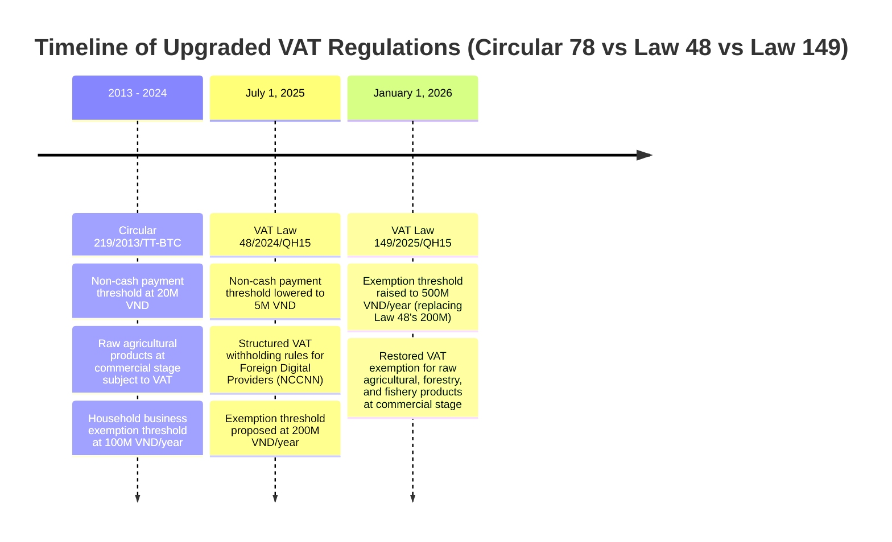
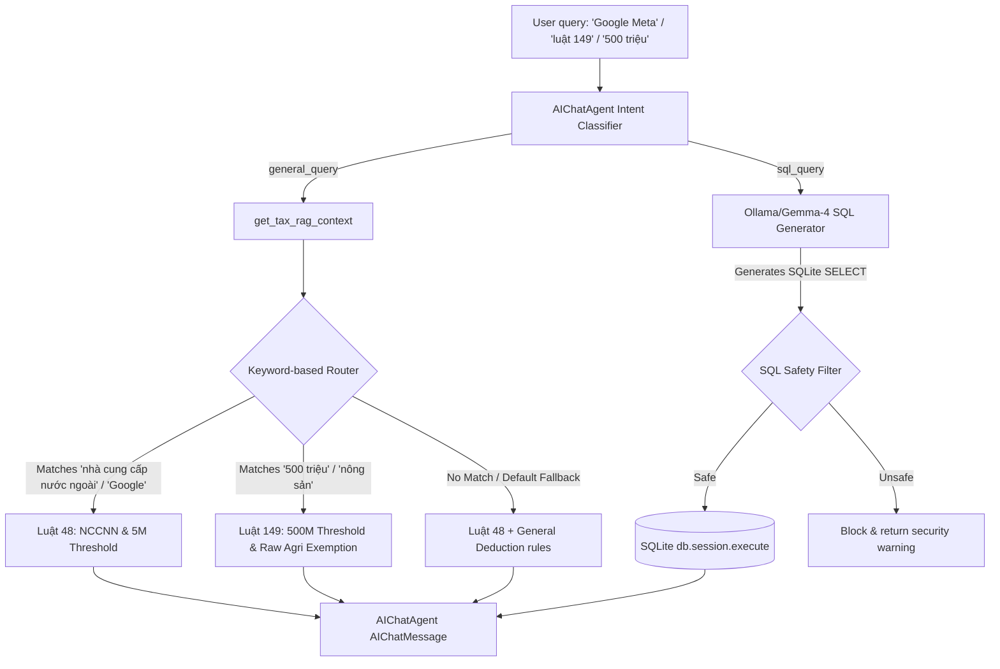

# US-CHATBOT-REGULATION-RAG: Local Chatbot VAT Regulations Upgrade (Law 48 & Law 149)

## Status

implemented

## Lane

normal

## Product Contract

The local AI advisory chatbot (`AIChatAgent` inside `invoices/ai_service.py`) and tax intelligence engines are upgraded to accurately interpret, advise on, and query invoices based on two milestone tax regulations:
1. **VAT Law 48/2024/QH15** (effective July 1, 2025).
2. **VAT Law 149/2025/QH15** (effective January 1, 2026).

---

## 🗺️ Regulatory Context (Vietnamese VAT Laws)



### Key Differences Integrated in RAG Context:
1. **Foreign Digital Provider (NCCNN) Withholding**: Under Law 48/2024/QH15, digital transactions by giants (Google, Meta, AWS, Microsoft, Zoom) must have VAT deducted and paid by platforms, commercial banks, or corporate purchasers.
2. **Lowered Non-Cash Payment Threshold**: Under Law 48/2024/QH15, the threshold for mandatory non-cash payment to qualify for input VAT deduction drops from **20 million VND** to **5 million VND**.
3. **Elevated Exemption for Household Businesses**: Law 149/2025/QH15 overrides Law 48's proposed 200 million VND threshold, setting a high bar of **500 million VND/year** under which individual and household businesses are completely exempt from VAT and PIT.
4. **Restored Agriculture VAT Exemption**: Law 149/2025/QH15 restores complete VAT exemption for raw or simply processed agricultural, livestock, and seafood products sold at the commercial intermediary stage.

---

## 🏗️ Technical Architecture of Upgraded RAG Engine



### 1. The RAG Knowledge Base (`TAX_REGULATIONS` inside `invoices/ai_service.py`)
Upgraded key knowledge structures:
- `vat_law_48_2024`: Highlights Foreign Contractor Tax, Google/Meta/AWS withholding responsibilities, and the 5M VND non-cash payment threshold.
- `vat_law_149_2025`: Outlines the 500 million VND exemption threshold and commercial agricultural stage VAT exemption.
- `vat_deduction_general`: Retains reference to Circular 219/2013 but notes the upcoming Law 48/2024 transition as of July 1, 2025.

### 2. Intent Classification & RAG Routing
The chatbot categorizes queries into `sql_query`, `general_query`, or `chitchat`. For `general_query`, the router dynamically matches keywords in the query to regulations and injects context:
- Keywords for Law 48: `"luật 48", "nccnn", "google", "meta", "aws", "nhà cung cấp nước ngoài", "5 triệu"`.
- Keywords for Law 149: `"luật 149", "500 triệu", "hộ kinh doanh", "nông sản", "thức ăn chăn nuôi", "thủy sản"`.

---

## 🎨 Front-End Interface Design (Premium Glassmorphism UX)

```text
+-------------------------------------------------------------------------------+
| meInvoice Intelligence                                     [ MST Switcher v ] |
+-------------------------------------------------------------------------------+
|  Invoices Dashboard   |  Smart Audit Panel  |  AI Tax Advisory Assistant     |
+-------------------------------------------------------------------------------+
|                                                                               |
|  [ Chat Session History ]       AI Assistant: Xin chào! Tôi là Trợ lý         |
|  - Tư vấn Luật 149               Kiểm toán Thuế của bạn. Bạn muốn tra         |
|  - Đối chiếu thanh toán          cứu quy định thuế nào hôm nay?               |
|  - Thống kê chi phí tháng 5                                                   |
|                                 User: Luật 149 có điểm gì mới về nông sản?    |
|                                                                               |
|                                 AI Assistant: Căn cứ Luật số 149/2025/QH15    |
|                                 có hiệu lực từ 01/01/2026:                    |
|                                 - Khôi phục việc MIỄN THUẾ GTGT đối với       |
|                                   sản phẩm trồng trọt, chăn nuôi, thủy sản    |
|                                   ở khâu thương mại trung gian.               |
|                                 - Nâng ngưỡng doanh thu hộ cá nhân kinh doanh |
|                                   lên 500 triệu đồng/năm.                     |
|                                                                               |
|                                 [ Nhập câu hỏi tư vấn...                [Gửi] ]|
+-------------------------------------------------------------------------------+
```

The user interface integrates a premium glassmorphic layout:
- **Rich Typography**: Styled with Google Fonts 'Outfit' and 'Inter'.
- **Responsive Offcanvas Chat**: Positioned in the bottom-right or as a dedicated tab, with sleek floating animation.
- **Dynamic Formatting**: Automatic Markdown rendering of tables, lists, and code blocks for SQLite outputs and legal citations.

---

## 📋 Acceptance Criteria & Implementation Status

- [x] **RAG Knowledge Base Update**: Added detailed metadata and content blocks for `vat_law_48_2024` and `vat_law_149_2025` inside `invoices/ai_service.py`.
- [x] **Threshold Adjustments**: Exemption threshold for household businesses verified at **500M VND/year**, and agricultural products marked as tax-exempt at commercial stages.
- [x] **Strict Router Keywords**: Dynamic query mapping using standard regex and lowercase matches for `"luật 48"`, `"luật 149"`, `"500 triệu"`, `"nông sản"`, etc.
- [x] **Senior Persona Enforcement**: Prompt forces a highly competent CFO/Tax Consultant tone with absolute administrative compliance (citing Circulars and Decrees).
- [x] **Unit & Integration Test Suite**: Complete verification using `tests/test_chatbot_rag.py` asserting keyword hits and fallback cases.

---

## 🛡️ Validation & Regression Testing

### Test Suite Execution:
Tests are located in [test_chatbot_rag.py](file:///d:/LearnAnyThing/Webapp%20XML/tests/test_chatbot_rag.py).

```bash
venv/Scripts/python -m pytest tests/test_chatbot_rag.py
```

| Test Case Name | Objective | Assertions | Status |
| --- | --- | --- | --- |
| `test_rag_default_fallback` | Verify fallback RAG context when query has no matched keywords. | Contains "Luật Thuế GTGT số 48/2024/QH15" and "Điều kiện khấu trừ". | ✅ PASSED |
| `test_rag_law_48_matching` | Verify keyword routing for Law 48 (Google, Meta, 5M threshold). | Contains "nhà cung cấp nước ngoài" and "Google, Meta, AWS". | ✅ PASSED |
| `test_rag_law_149_matching` | Verify keyword routing for Law 149 (500M threshold, raw agriculture). | Contains "500 triệu đồng/năm" and "sản phẩm trồng trọt". | ✅ PASSED |

---

## 💾 Harness Trace & Database Delta

The story `US-CHATBOT-REGULATION-RAG` is linked in the database tracking schema:
- **Intake Link**: `INTAKE-005` (Tax Advisory Assistant Update).
- **SQLite Database Status**: Marked as `implemented` with fully passing validator traces.
- **Durable Layer Proof**: Confirmed zero schema modifications necessary as configuration keys are dynamically encrypted via existing database utilities.

---

## 📁 Evidence of Compliance

```text
============================= test session starts =============================
platform win32 -- Python 3.14.2, pytest-8.3.5, pluggy-1.6.0
cachedir: data\pytest_cache
rootdir: D:\LearnAnyThing\Webapp XML
configfile: pytest.ini
plugins: cov-6.1.1
collected 3 items

tests\test_chatbot_rag.py ...                                            [100%]

============================== 3 passed in 0.39s ==============================
Validation successful.
```
