# Epic Map: Version 10.0.0 Enterprise Tax Advisory RAG Pro & Multi-Tenancy Orchestrator

Bản đồ phân rã năng lực chiến lược (Epics), câu chuyện người dùng (Stories) và kế hoạch triển khai của Version 10.0.0.

---

## 🗺️ Bản đồ Chiến dịch (Epic Map)

```mermaid
graph TD
    classDef epic fill:#1E293B,stroke:#38BDF8,stroke-width:2px,color:#F8FAFC;
    classDef story fill:#0F172A,stroke:#F43F5E,stroke-width:1px,color:#E2E8F0;

    Epic1["Epic 1: Multi-Tenancy Core Router & Schema Isolation"]:::epic
    Epic2["Epic 2: Local AI RAG Pro (Gemma-4/Llama-3 Offline Consultant)"]:::epic
    Epic3["Epic 3: Smart Auto-Correction & Accountant Confirmation Hub"]:::epic
    Epic4["Epic 4: Fraud Fingerprinting Hard-Blocker Ingestion Gate"]:::epic

    Story11["Story 1.1: SQLAlchemy Dynamic Connection Bind Router"]:::story
    Story12["Story 1.2: Automatic Schema Bootstrapper & Backup Isolation"]:::story
    
    Story21["Story 2.1: Ollama API Integration with Conversational History"]:::story
    Story22["Story 2.2: Hybrid FTS5 Context Retrieval & UI Chat Assistant"]:::story

    Story31["Story 3.1: DB Schema InvoiceCorrectionProposal & AI Mismatch Parser"]:::story
    Story32["Story 3.2: Glassmorphism Correction Widget & Approval API"]:::story

    Story41["Story 4.1: Cryptographic Hash Ledger & Blacklist Check"]:::story
    Story42["Story 4.2: Hard Validation Blocking & Dynamic Rejection UI"]:::story

    Epic1 --> Story11
    Epic1 --> Story12
    
    Epic2 --> Story21
    Epic2 --> Story22

    Epic3 --> Story31
    Epic3 --> Story32

    Epic4 --> Story41
    Epic4 --> Story42
```

---

## 🎯 Gói Câu chuyện Hiện tại (Current Story Pack - Sprint 1)

Chúng ta tập trung hoàn thành các nền tảng kỹ thuật then chốt và các cổng kiểm chứng rủi ro trước khi mở rộng giao diện.

### 1. Story 1.1: SQLAlchemy Dynamic Connection Bind Router (Rủi ro kỹ thuật cao nhất)
* **Mục tiêu**: Xây dựng cơ chế đổi kết nối CSDL động của SQLAlchemy theo phiên làm việc `session["tax_code"]`.
* **Tiêu chí nghiệm thu (Acceptance Criteria)**:
  * Khi người dùng có `session["tax_code"] = "0109999999"`, tất cả các truy vấn Invoice sẽ được định tuyến tự động và độc lập đến `data/tenant_0109999999.db`.
  * Khi không có session hoặc MST trống, mặc định định tuyến về tệp gốc `data/invoice.db`.
  * Hệ thống giải phóng kết nối sạch sau khi request kết thúc.
  * Toàn bộ 373 kiểm thử cũ vượt qua thành công trên CSDL gốc.

### 2. Story 2.1: Ollama API Integration with Conversational History (Rủi ro hiệu năng)
* **Mục tiêu**: Tích hợp luồng trò chuyện tư vấn thuế với Ollama chạy offline, hỗ trợ ghi nhớ lịch sử hội thoại dạng JSON.
* **Tiêu chí nghiệm thu**:
  * Tích hợp cấu hình endpoint Ollama trong System Settings.
  * API `/api/ai/advise` trả về phản hồi từ Gemma-4 hoặc Llama-3 chạy cục bộ.
  * Hỗ trợ lưu trữ tối đa 10 tin nhắn lịch sử để giữ ngữ cảnh câu hỏi tiếp theo.

### 3. Story 3.1: DB Schema InvoiceCorrectionProposal & AI Mismatch Parser
* **Mục tiêu**: Định nghĩa bảng đề xuất sửa đổi và bộ lọc AI tạo đề xuất nháp.
* **Tiêu chí nghiệm thu**:
  * Khởi tạo bảng `InvoiceCorrectionProposal` thông qua Auto-migration tự động khi khởi động app.
  * AI Auditor khi quét hóa đơn phát hiện lệch tên/lệch thuế suất sẽ tạo bản ghi `pending` thay vì sửa đổi DB trực tiếp.

### 4. Story 4.1: Cryptographic Hash Ledger & Blacklist Check
* **Mục tiêu**: Thiết lập bộ lọc chữ ký số và danh sách đen để chặn hóa đơn lỗi.
* **Tiêu chí nghiệm thu**:
  * Khi tải hóa đơn XML lên, đối chiếu chữ ký số và MST người bán với danh mục đen của Tổng cục Thuế.
  * Ném ra lỗi `FraudValidationError` nếu phát hiện trùng lặp hash gian lận hoặc đối tác nằm trong danh sách đen.

---

## 🗓️ Giai đoạn tiếp theo (Deferred Work / Sprint 2)
* Hoàn thiện widget Glassmorphism hiển thị Đề xuất sửa lỗi và nút Duyệt nhanh trên UI.
* Triển khai hộp thoại trợ lý ảo AI nổi (Floating Chat Panel) sử dụng thiết kế kính mờ tinh tế và micro-animations.
* Xây dựng giao diện System Settings quản lý cấu hình Multi-tenant & Đăng ký CSDL biệt lập cho từng MST doanh nghiệp.
