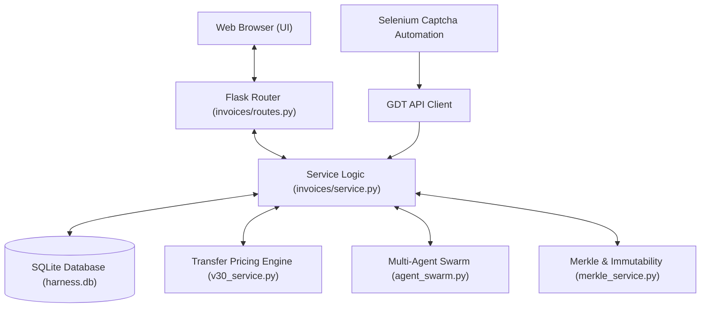
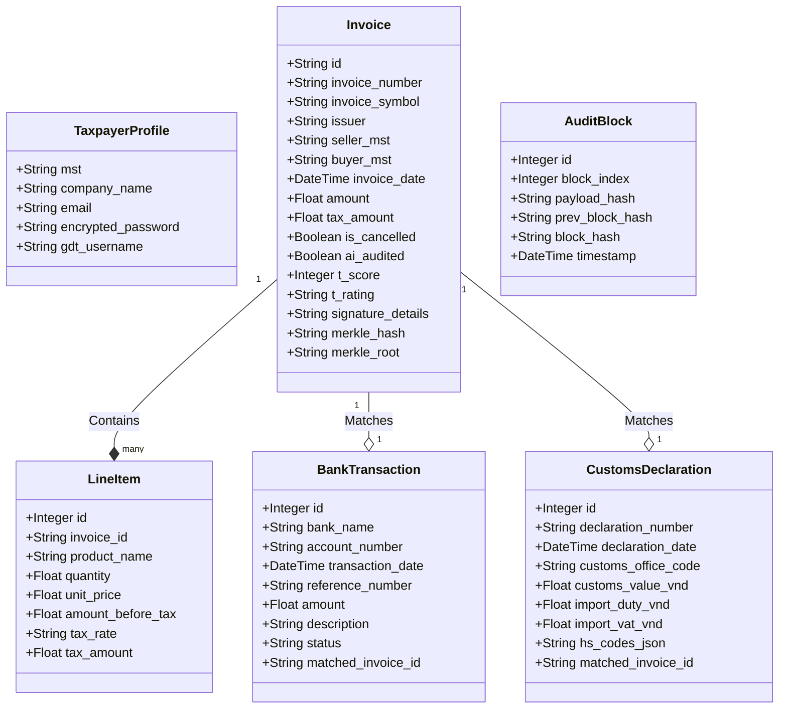

# Webapp Implementation Walkthrough

This document maps the **Invoice Download Webapp** codebase to the modern modular specification hierarchy (`docs/product/`). It details the software architecture, database schemas, functional layers, compliance logic, and security systems.

---

## 🏗️ 1. Architecture & Core Portals

The webapp is designed as an on-premise, container-ready Python Flask application. It eliminates dependencies on external SaaS platforms to keep raw tax data and corporate financial details completely private.



### 📂 Module Organization
*   **`app.py`**: Initializes the Flask context, registers blueprints, configures extensions (`db`), and sets up error handlers.
*   **`config.py`**: Defines configurations such as SQLite database paths, Selenium timeout policies, token parameters, and mock mode configurations.
*   **`extensions.py`**: Exports global shared SQLAlchemy instances (`db`), database helper macros, role checks, and JWT processing mechanisms.
*   **`auth/`**: Manages session state, local credential encryption/decryption, and interfaces with the Selenium solver.
*   **`invoices/`**:
    *   `models.py`: Declares SQLAlchemy models representing tax invoices, banking streams, ledger logs, and inter-agent communication messages.
    *   `routes.py`: Exposes JSON API endpoints and renders server-side templates.
    *   `service.py`: Performs HTTP operations against GDT endpoints, downloads XML/PDF source payloads, and handles duplicate storage strategies.
    *   `parser.py`: Extracts seller metadata, buyer tags, amounts, line items, and digital signatures from XML strings.
    *   `v30_service.py`: Performs Decree 132/2020/ND-CP cost-plus markup calculations, IQR analyses, and CIT risk evaluations.
    *   `agent_swarm.py`: Orchestrates specialized agent bots to draft audit defense dossiers and suggest XML repairs.
*   **`export/`**:
    *   `excel.py` & `formatter.py`: Compiled spreadsheet generators utilizing `openpyxl` to apply accounting-compliant layouts, borders, and column formatting.

---

## 🗄️ 2. Database Schema & Data Models (`invoices/models.py`)

All transaction records, partner lists, audit logs, and agent queues are persisted in a single local SQLite database: `harness.db`. 



### Key Models Mapping to Specifications
1.  **`Invoice` / `LineItem`**: Stores the parsed elements from official XMLs. Fields like `ai_audited`, `t_score`, and `t_rating` support the compliance dashboard.
2.  **`BankTransaction`**: Holds bank CSV records, reconciling payments with `matched_invoice_id`.
3.  **`CustomsDeclaration`**: Tracks VNACCS declarations matched against import invoices for import-VAT tax audits.
4.  **`AuditBlock`**: Stores transaction hashes to establish a local block-like sequence of audit records.
5.  **`AgentMessage`**: Supports inter-agent communication, serving as a mailbox queue for background swarm operations.

---

## 📥 3. Ingestion & Reconciliation Flows

The webapp ingests financial data through three distinct streams:

### Stream A: GDT Portal Scraping & Captcha Solve
```
[User Login UI] ──> [Selenium Driver] ──> [Pre-fetch Captcha Image] ──> [Local Neural Solver]
                                                                                │
[GDT API Session Cookie] <── [Verify Session] <── [Submit Captcha & Credentials] ┘
```
1.  **Session Recovery**: `invoices/service.py` monitors HTTP headers. If an active session expires, it initiates a retry flow, invoking the Selenium module in the background to solve a fresh Captcha and restore the cookie cache.
2.  **Duplicate Strategy**: When downloading batch files, users choose to `Overwrite`, `Skip`, or `Archive` matching local records to prevent data corruption.

### Stream B: Bank Statement CSV Matching
*   **Module**: `invoices/reconciliation_service.py`
*   **Logic**: Parses standard CSV formats (Joint Stock Banks: VCB, Techcombank, BIDV, VietinBank). Matches bank entries to unpaid invoices by matching the buyer's MST, checking the amount within a 0.5% tolerance window, and looking for matches on invoice symbols or codes in the bank description.

### Stream C: E-Commerce Transaction Normalizer
*   **Module**: `invoices/ecommerce_service.py`
*   **Logic**: Imports API reports from Lazada, Shopee, and TikTok Shop. It cross-checks order numbers, product descriptions, buyer details, and transaction fees against physical invoices to identify un-invoiced transactions or value-added tax gaps.

---

## ⚖️ 4. Compliance Audits & Calculations

Compliance auditing is divided into two engines:

### Related-Party Transfer Pricing (Decree 132/2020/ND-CP)
*   **Module**: `invoices/v30_service.py`
*   **IQR Benchmarks**: Defines standard Cost Plus Markup percentiles ($P_{35}$, Median, $P_{75}$) across three primary industries: Manufacturing (8% - 16.5%), Services (10% - 20%), and Distribution (4.5% - 9%).
*   **Adjustments Formula**:
    If a transaction's markup percent is less than the $P_{35}$ benchmark:
    $$\text{Adjusted Revenue} = \text{Cost of Goods} \times (1 + \text{Median Percent})$$
    $$\text{Tax Underpaid} = (\text{Adjusted Revenue} - \text{Actual Revenue}) \times 20\%$$
    $$\text{Penalty} = \text{Tax Underpaid} \times 20\%$$
    $$\text{Late Interest} = \text{Tax Underpaid} \times 0.03\% \times \text{Days Overdue}$$

### Decree 123 Structure Validation & Auto-Repair
*   **Module**: `invoices/parser.py` & `invoices/agent_swarm.py`
*   **Logic**: Validates that digital signatures correspond to registered taxpayers, checks for invalid characters in XML templates, and flags discrepancies between line total sums and taxable sub-totals.
*   **Auto-Repair Swarm**: When schema issues are detected, a background agent creates a modified XML draft containing clean formatting and corrected math parameters, submitting the draft for review before processing.

---

## 🔒 5. Cryptographic Immutability & Swarm Advisors

### Blockchain Ledger Immutability (`AuditBlock`)
To prevent logs from being altered during tax audits, database triggers enforce append-only rules on audit logs:
*   **Listeners**: SQLAlchemy event listeners prevent modifications or deletions on the `AuditBlock` table.
*   **Merkle Tree Security**:
    *   **Module**: `invoices/merkle_service.py`
    *   **Logic**: Each incoming invoice is hashed. A Merkle Tree is built from the hash list, storing the root hash in the database. Any change in a historical record invalidates the tree structure, immediately flagging the system status as "Compromised".

### Multi-Agent Swarm Advisor Engine
*   **Module**: `invoices/agent_swarm.py`
*   **Swarm Roles**:
    *   **JointAuditCoordinator**: Orchestrates data distribution and tasks.
    *   **TransferPricingSpecialist**: Performs IQR analysis and flags low margin margins.
    *   **CITSpecialist**: Computes CIT penalty calculations and adjustments.
    *   **VATSpecialist**: Validates non-cash payment certifications.
*   **Result**: Outputs a formatted **Transfer Pricing Audit Preparation Dossier** containing structured regulatory advice and lists of local verification documents required by tax authorities.
